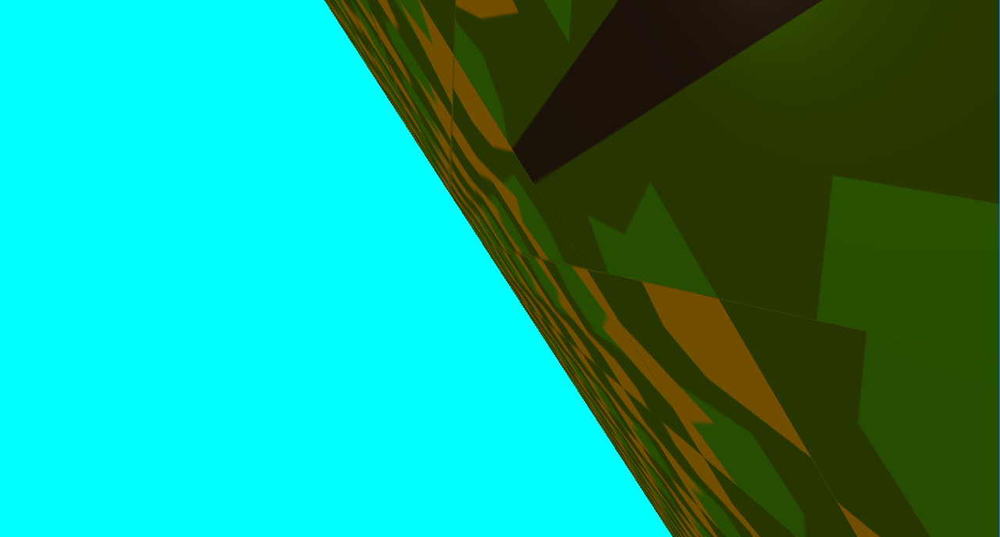
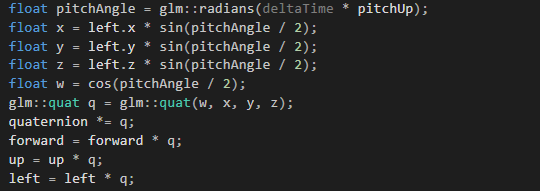

# FlightSimulator



A basic point camera flight simulator.

# Running the executable
+ Download the latest executable form the [releases page](https://github.com/TheGameDevDude/FlightSimulator/releases/tag/v0.1).
+ The executable only works on windows.

# controls

| Action | Key |
|--------|-----|
| Throttle | <kbd>W</kbd> |
| Lower Throttle | <kbd>S</kbd> |
| Yaw | <kbd>Q</kbd> <kbd>E</kbd> |
| Pitch | <kbd>↑</kbd> <kbd>↓</kbd> |
| Roll | <kbd>←</kbd> <kbd>→</kbd> |
 
# How the plane fly's
Every plane has pitch, yaw, and roll and I tried to achieve this by using Euler angle rotation matrices and failed miserably and after long hours of googling, I found that they use Quaternions because its easier to rotate along any direction compared to euler.

Here's where I learned about Quaternions: http://www.opengl-tutorial.org/intermediate-tutorials/tutorial-17-quaternions/

so I had to create plane axis forward, up and left, forward pointing the front of the plane, left pointing left of plane so that the forward vector can rotate along left axis as pitch of the plane using quaternions. 


Here's how I pitch the plane:



and same applies for roll and yaw, this is how every flight simulator handles orientation.

And for torque I had to multiply with a variable that increases then becomes constant, that "pitchUp" variable will increase at the beginning then clamps to constant value.

in order for the plane to move forward I just incremented the forward vector and scaled it with a "forwardSpeed" variable.

Heres the pseudo  code for move function:
```
if(W key){
    thrust += deltaTime;
    gravity -= deltaTime;
    clamp thrust and gravity
    forward += deltaTime;
    clamp forward variable;
} else {
    gravity += deltaTime;
    thrust -= deltaTime;
    clamp thrust and gravity
    forward += 0.2 * acceleration * GLIDESPEED * deltaTime;
    forward -= deltaTime;
    clamp forward variable;
}
Acceleration += gravity;
Acceleration -= thrust;
Ypos -= Acceleration;
Also clamp acceleration to zero
```
If the roll or pitch angle is too big or if the plane is upside down and collides with the ground then the plane crashes so I just reset the plane.

I also added a spot light in front of the plane so you can see how close you are with the ground.

use W for thrust and arrow keys for rolling and pitching.

### ScreenShots


youtube link: https://www.youtube.com/watch?v=C9zNYBBjB90&feature=youtu.be


